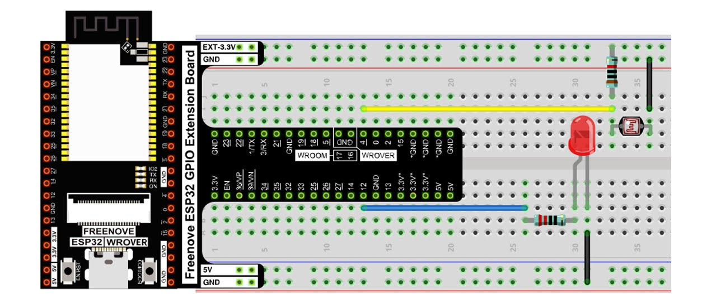

🌞🌙 Rilevamento Giorno/Notte con Arduino e Sensore Fotosensibile

Questo progetto ha come obiettivo la realizzazione di un dispositivo basato su Arduino capace di rilevare se è giorno o notte, grazie a un sensore fotosensibile (LDR o simili).

🎯 Obiettivo

Utilizzare un sensore di luce per monitorare la luminosità ambientale.

Determinare automaticamente se è giorno o notte in base a una soglia di luce predefinita.

Inviare una notifica al telefono ogni volta che lo stato cambia (da giorno a notte o viceversa).

🛠️ Componenti Utilizzati

Arduino Uno (o compatibile)

Sensore di luce (LDR)

Resistenze

Modulo Wi-Fi (es. ESP8266 o simile)

Smartphone con app per ricevere notifiche (Telegram, Blynk, IFTTT ecc.)

🔔 Funzionamento

Il sensore rileva costantemente il livello di luce ambientale.

Se il valore scende o supera una certa soglia, viene determinato lo stato giorno o notte.

Il sistema invia una notifica al telefono informando del cambiamento.

🚀 Possibili Sviluppi Futuri

Personalizzazione delle soglie giorno/notte

Interfaccia mobile per configurazione

Log storico degli stati

📸 Demo / Foto (facoltativo)

📄 Licenza

Questo progetto è distribuito sotto licenza MIT - vedi il file LICENSE per i dettagli.
