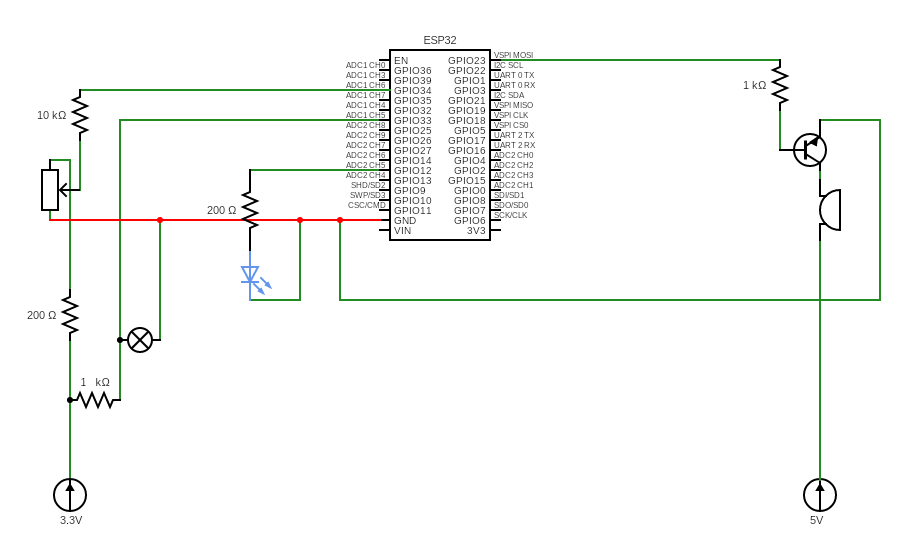
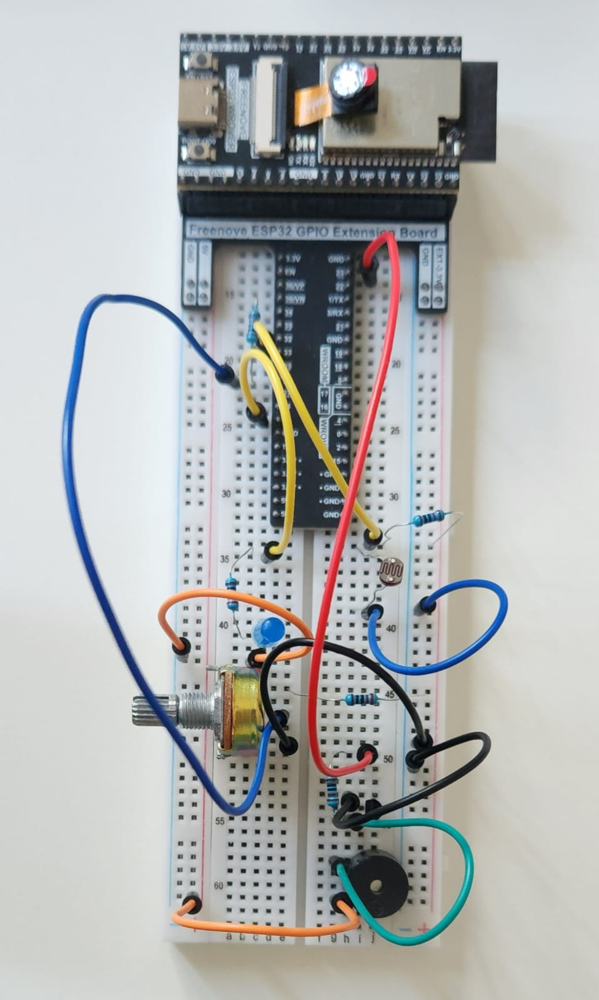

# SENSORE DI OMBRE CON ARDUINO

## OBIETTIVO

Realizzare un dispositivo in grado di rilevare **variazioni** nella **luminosità ambientale** e inviare eventi **in tempo reale** a un server Django, con autenticazione locale e protezione contro tentativi di accesso **non autorizzati**.

Il progetto integra **componenti elettronici** con una **piattaforma web** per la visualizzazione degli eventi registrati. L’utente può **personalizzare** la soglia di sensibilità alla luce e la password di accesso.

## COMPONENTI UTILIZZATI

- x1 Bread board

- x1 ESP32 con modulo Wi-Fi

- x1 Potenziometro

- x1 Buzzer attivo

- x1 Fotoresistore

- x1 Transistor

- x1 LED

- x2 Resistore 220 Ohm
  
- x1 Resistore 10k Ohm

- x2 Resistore 1k Ohm

- x10 cavetti

- x1 cavo USB-C

- Fonti (3.3V, 5V)

## FUNZIONAMENTO

Il dispositivo è composto da un **ESP32**, un fotoresistore (LDR), un LED, un potenziometro e un buzzer. Il sensore LDR rileva costantemente il livello di luce ambientale. Quando il valore misurato scende al di sotto di una soglia predefinita (configurata direttamente nel codice), il sistema considera che ci sia ombra o bassa luminosità.

In tal caso:

Il LED si accende per indicare la **presenza di buio**.

Lo **stato del LED** (acceso/spento) viene trasmesso tramite **Wi-Fi** al server Django e registrato in un database con data e ora.

L’interfaccia web del server consente di visualizzare in tempo reale lo storico dei cambiamenti.

In alternativa, è possibile consultare lo stato corrente direttamente nel Serial Monitor, solo dopo aver superato un processo di autenticazione.

## SICUREZZA

- L'accesso ai dati locali traamite Serial Monitor è **protetto da password**
- Dopo 3 tentativi errati, il sistema attiva un **buzzer di allarme** e blocca ulteriori inserimenti.
- Il **reset** del blocco avviene manualmente ruotando il **potenziomentro**, che funge da meccanismo di sblocco
- Sia la **soglia di sensibilità** che la **password** possono essere personalizzate nel codice

## COMUNICAZIONE CON IL SERVER

- ESP32 invia eventi **HTTP POST** al server Django
- Ogni evento viene registrato con **timestamp**
- La **UI web** mostra lo storico degli stati del LED (accesso, spento)

## PREREQUISITI

Python + Django installati su server locale o cloud

Libreria Wi-Fi per ESP32 (inclusa nell'IDE Arduino)

Conoscenze base di circuiti elettronici e programmazione embedded

## GUIDA ALL'INSTALLAZIONE

1. Clona questo repository
2. Avvia il server Django (`python manage.py runserver`)
3. Collega l’ESP32 alla stessa rete WIFI del server
4. Carica il firmware sull'ESP32 tramite Arduino IDE
5. Imposta soglia e password all'interno del codice o via terminale

## RAPPRESENTAZIONE DEL CIRCUITO

## GUIDA AL DEBUGGING

- Sebbene molti pin dell’ESP32 supportino l’input analogico, solo quelli tra 32 e 39 funzionano correttamente durante l’uso del modulo Wi-Fi. Assicurati che il fotoresistore sia collegato a uno di questi.

- Per permettere la comunicazione tra l’ESP32 e il server Django, disattiva temporaneamente il firewall della macchina oppure autorizza la porta usata dal server (default: 8000).

## FOTO DEL RISULTATO FINALE

## POSSIBILI SVILUPPI FUTURI

- Personalizzazione dinamica della soglia tramite interfaccia web o API.

- Invio notifiche su dispositivi personali (tramite email, Telegram, ecc.).

- Storico degli eventi visualizzati tramite grafici interattivi
