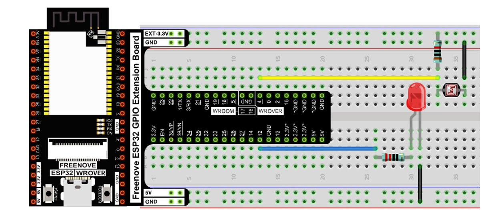

# SENSORE DI OMBRE CON ARDUINO

## OBIETTIVO

Questo progetto ha come obiettivo la realizzazione di un dispositivo Arduino capace di rilevare la presenza o l'assenza di luce.

La sensibilità dello strumento potrà essere customizzata dall'utente, in base alle sue necessità.

Insieme alle specifiche del dispositivo, questo progetto comprende un server Django su cui l'arduino invierà **live** i cambiamenti di stato luce/ombra. Il server registrerà sul database la data e ora in cui è avvenuto ogni cambiamento di stato

Il server è provvisto di un UI user friendly.

## COMPONENTI UTILIZZATI

- x1 Bread Board

- x1 Fotoresistore

- x1 Resistenza 220 Ohm
  
- x1 Resistenza 10 KOhm

- x1 LED

- x1 ESP32 con Modulo Wi-Fi

- x1 cavo USB-C

## FUNZIONAMENTO

Quando acceso, il sensore rileva continuamente il livello di luce ambientale.

Se il valore è inferiore o supera la soglia impostata dall'utente l'arduino invia una segnale di cambiamento di stato, da luce a ombra o viceversa.

Il dispositivo invia una notifica al server e il server la archivia con relative data e ora.

## POSSIBILI SVILUPPI FUTURI

Personalizzazione dinamica della soglia tramite interfaccia web o API.

Invio notifiche su dispositivi personali (tramite email, Telegram, ecc.).

Storico dei dati con visualizzazione tramite grafici.

## RAPPRESENTAZIONE DEL CIRCUITO

## SFIDE DELLO SVILUPPO

Nonostante tutti contatti di output presenti sull'ESP32 suppotino la tecnologia analogica, solamente quelli compresi tra 32 e 37 supportano l'analogico con il WiFI.

Per permettere la comunicazione tra l'arduino e il server Django sarà disattivare il Firewall della macchina su cui si trova il server o, preferibilmente, impostare una regola specifica.

## REQUISITI

Python + Django installati su server locale o cloud

Libreria Wi-Fi per ESP32 (inclusa nell'IDE Arduino)

Conoscenze base di circuiti elettronici e programmazione embedded
